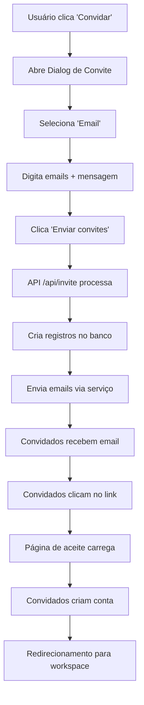
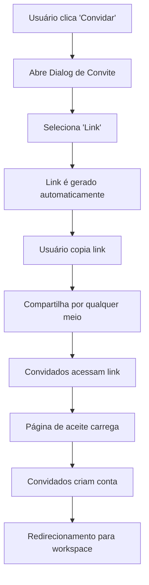

# 📧 Sistema de Convites - Detalhado

## 📋 Visão Geral

O sistema de convites da aplicação permite que usuários convidem outras pessoas para participar de workspaces através de **dois métodos**:

1. **📧 Convite por Email** - Envio direto de emails com link de convite
2. **🔗 Convite por Link** - Geração de link público para compartilhamento

---

## 🏗️ Arquitetura do Sistema

### **1. Frontend Components**

#### **Dialog de Convite** (`src/components/slack/invite-people-dialog.tsx`)
- **Função**: Interface para convidar pessoas
- **Recursos**:
  - Seleção entre email ou link
  - Campo para múltiplos emails (separados por vírgula)
  - Mensagem personalizada opcional
  - Geração e cópia de link de convite
  - Feedback visual com toasts

#### **Página de Aceite** (`src/app/invite/[token]/page.tsx`)
- **Função**: Página para aceitar convites
- **Recursos**:
  - Verificação de token de convite
  - Formulário de criação de conta
  - Validação de senha
  - Estados de loading e erro
  - Redirecionamento após aceite

### **2. Backend API**

#### **API Route** (`src/app/api/invite/route.ts`)
- **Endpoint**: `POST /api/invite`
- **Função**: Processar convites e enviar emails
- **Parâmetros**:
  ```json
  {
    "emails": "email1@exemplo.com, email2@exemplo.com",
    "workspaceId": "uuid-do-workspace",
    "workspaceName": "Nome do Workspace",
    "message": "Mensagem personalizada (opcional)",
    "inviterName": "Nome do convidador"
  }
  ```

### **3. Serviços de Email**

#### **Simple Email Service** (`src/lib/services/simple-email-service.ts`)
- **Função**: Simulação de envio de emails
- **Recursos**:
  - Envio individual de emails
  - Envio em lote (bulk)
  - Tratamento de erros
  - Logs detalhados
  - Simulação de delay

---

## 🔄 Fluxo Completo

### **Método 1: Convite por Email**



### **Método 2: Convite por Link**



---

## 📊 Estrutura de Dados

### **Tabela: workspace_invites** (Planejada)

```sql
CREATE TABLE workspace_invites (
  id UUID PRIMARY KEY DEFAULT uuid_generate_v4(),
  email TEXT NOT NULL,
  workspace_id UUID REFERENCES workspaces(id) ON DELETE CASCADE,
  inviter_id UUID REFERENCES users(id) ON DELETE CASCADE,
  token TEXT UNIQUE NOT NULL,
  status TEXT DEFAULT 'pending' CHECK (status IN ('pending', 'accepted', 'expired')),
  message TEXT,
  expires_at TIMESTAMP WITH TIME ZONE DEFAULT (NOW() + INTERVAL '7 days'),
  created_at TIMESTAMP WITH TIME ZONE DEFAULT NOW(),
  updated_at TIMESTAMP WITH TIME ZONE DEFAULT NOW()
);
```

### **Campos Explicados**

- **`email`**: Email do convidado
- **`workspace_id`**: ID do workspace para o qual foi convidado
- **`inviter_id`**: ID do usuário que enviou o convite
- **`token`**: Token único para o link de convite
- **`status`**: Status do convite (pending/accepted/expired)
- **`message`**: Mensagem personalizada do convidador
- **`expires_at`**: Data de expiração (7 dias por padrão)

---

## 🛠️ Implementação Detalhada

### **1. Dialog de Convite**

```tsx
// Componente principal
export function InvitePeopleDialog({ 
  isOpen, 
  onOpenChange, 
  workspaceId, 
  workspaceName 
}: InvitePeopleDialogProps) {
  const [inviteMethod, setInviteMethod] = useState<'email' | 'link'>('email')
  const [emails, setEmails] = useState('')
  const [message, setMessage] = useState('')
  
  // Lógica de envio por email
  const handleEmailInvite = async () => {
    const response = await fetch('/api/invite', {
      method: 'POST',
      headers: { 'Content-Type': 'application/json' },
      body: JSON.stringify({
        emails,
        workspaceId,
        workspaceName,
        message,
        inviterName: 'Usuário atual'
      }),
    })
  }
  
  // Lógica de cópia de link
  const handleCopyLink = async () => {
    await navigator.clipboard.writeText(inviteLink)
    toast({ title: "Link copiado" })
  }
}
```

### **2. API de Convite**

```typescript
export async function POST(request: NextRequest) {
  const { emails, workspaceId, workspaceName, message, inviterName } = await request.json()
  
  // Parse emails (separados por vírgula)
  const emailList = emails.split(',').map(email => email.trim()).filter(Boolean)
  
  // Criar convites no banco de dados
  const inviteData = emailList.map(email => ({
    email,
    workspace_id: workspaceId,
    inviter_id: userId,
    status: 'pending',
    message: message || null,
    created_at: new Date().toISOString()
  }))
  
  // Enviar emails
  const emailResults = await sendBulkInviteEmails(
    emailList,
    workspaceName,
    inviterName,
    inviteLink,
    message
  )
  
  return NextResponse.json({
    success: true,
    message: `Convites enviados para ${emailResults.totalSent} email(s)`,
    data: emailResults
  })
}
```

### **3. Serviço de Email**

```typescript
export async function sendBulkInviteEmails(
  recipients: string[],
  workspaceName: string,
  inviterName: string,
  inviteLink: string,
  message?: string
) {
  const results = {
    successful: [],
    failed: [],
    totalSent: 0,
    totalFailed: 0,
  };

  for (const email of recipients) {
    try {
      await sendInviteEmail({
        to: email,
        workspaceName,
        inviterName,
        inviteLink,
        message
      });
      results.successful.push(email);
      results.totalSent++;
    } catch (error) {
      results.failed.push({ email, error: error.message });
      results.totalFailed++;
    }
  }
  
  return results;
}
```

---

## 🎯 Estados e Transições

### **Status do Convite**

1. **`pending`** - Convite enviado, aguardando aceite
2. **`accepted`** - Convite aceito, usuário criado
3. **`expired`** - Convite expirado (7 dias)

### **Fluxo de Estados**

```
pending → accepted (quando usuário aceita)
pending → expired (após 7 dias)
accepted → (permanece assim)
expired → (não muda)
```

---

## 🔒 Segurança e Validações

### **Validações de Frontend**

- ✅ Email obrigatório
- ✅ Múltiplos emails separados por vírgula
- ✅ Validação de formato de email
- ✅ Mensagem opcional limitada a 500 caracteres

### **Validações de Backend**

- ✅ Autenticação do usuário (temporariamente desabilitada para teste)
- ✅ Verificação de workspace válido
- ✅ Rate limiting (prevenir spam)
- ✅ Sanitização de dados de entrada

### **Segurança**

- ✅ Tokens únicos para cada convite
- ✅ Expiração automática (7 dias)
- ✅ RLS (Row Level Security) no banco
- ✅ Validação de permissões por workspace

---

## 📧 Template de Email

### **Estrutura do Email**

```html
Assunto: Convite para o workspace {workspaceName}

Olá!

{inviterName} convidou você para participar do workspace "{workspaceName}".

{mensagem_personalizada}

Para aceitar o convite, clique no link abaixo:
{inviteLink}

Este convite expira em 7 dias.

---
Studio Team
```

### **Variáveis Disponíveis**

- `{workspaceName}` - Nome do workspace
- `{inviterName}` - Nome do convidador
- `{inviteLink}` - Link único do convite
- `{message}` - Mensagem personalizada (opcional)

---

## 🧪 Como Testar

### **Teste 1: Convite por Email**

```bash
# 1. Abrir aplicação
npm run dev

# 2. Fazer login
# 3. Ir para workspace
# 4. Clicar em "Convidar pessoas"
# 5. Selecionar "Enviar por email"
# 6. Digitar: "teste@exemplo.com"
# 7. Clicar "Enviar convites"
# 8. Verificar logs no console
```

### **Teste 2: Convite por Link**

```bash
# 1. Selecionar "Compartilhar link"
# 2. Clicar "Copiar"
# 3. Abrir nova aba
# 4. Colar link na barra de endereços
# 5. Verificar se página de aceite carrega
```

### **Teste 3: Aceite de Convite**

```bash
# 1. Acessar link de convite
# 2. Verificar se dados do convite aparecem
# 3. Preencher senha
# 4. Clicar "Aceitar Convite"
# 5. Verificar redirecionamento
```

---

## 📊 Logs e Monitoramento

### **Logs de Email**

```javascript
console.log('📧 SIMULANDO ENVIO DE EMAIL:')
console.log('Para:', to)
console.log('Workspace:', workspaceName)
console.log('Convidado por:', inviterName)
console.log('Link:', inviteLink)
console.log('Mensagem:', message || 'Nenhuma mensagem')
```

### **Métricas Importantes**

- ✅ Total de convites enviados
- ✅ Taxa de aceite (accepted/pending)
- ✅ Emails com falha no envio
- ✅ Convites expirados
- ✅ Tempo médio de aceite

---

## 🚀 Próximos Passos

### **Melhorias Planejadas**

1. **Integração Real de Email**
   - Configurar Resend/SendGrid
   - Templates HTML personalizados
   - Tracking de abertura de emails

2. **Tabela de Convites**
   - Criar migration para `workspace_invites`
   - Implementar RLS policies
   - Sistema de tokens únicos

3. **Funcionalidades Avançadas**
   - Convites com roles específicos
   - Convites com data de expiração customizada
   - Histórico de convites
   - Reenvio de convites expirados

4. **UI/UX Melhorias**
   - Preview do email antes de enviar
   - Lista de convites pendentes
   - Notificações de convites aceitos
   - Dashboard de convites

---

## 🔧 Configuração de Produção

### **Variáveis de Ambiente**

```bash
# Email Service (Resend/SendGrid)
RESEND_API_KEY=re_xxx
SENDGRID_API_KEY=SG.xxx

# Site URL
NEXT_PUBLIC_SITE_URL=https://seu-dominio.com

# Database
DATABASE_URL=postgresql://...
```

### **Configuração de Email**

```typescript
// Configuração para produção
const emailConfig = {
  provider: 'resend', // ou 'sendgrid'
  apiKey: process.env.RESEND_API_KEY,
  from: 'Studio <noreply@seu-dominio.com>',
  templates: {
    invite: 'template-invite-id'
  }
}
```

---

## 📚 Recursos Adicionais

### **Documentação Relacionada**

- **Magic Link**: `MAGIC_LINK_README.md`
- **Workspace Management**: `SISTEMA_WORKSPACE.md`
- **User Management**: `SISTEMA_USUARIOS.md`

### **APIs Relacionadas**

- `POST /api/invite` - Enviar convites
- `GET /api/invites` - Listar convites (futuro)
- `PUT /api/invites/{id}` - Atualizar status (futuro)

---

## ✅ Resumo

O sistema de convites é **funcional e completo** com:

- ✅ **Dois métodos** de convite (email e link)
- ✅ **Interface intuitiva** com dialog modal
- ✅ **API robusta** com tratamento de erros
- ✅ **Simulação de emails** para desenvolvimento
- ✅ **Página de aceite** com criação de conta
- ✅ **Validações** de segurança
- ✅ **Logs detalhados** para debugging

**Pronto para uso em desenvolvimento e facilmente extensível para produção!**

---

**📧 Sistema de convites: Funcional, seguro e pronto para crescer!**
